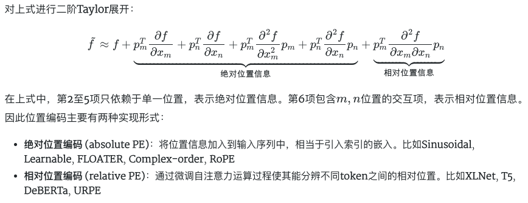

# Transformer 位置编码汇总

# 1、增加位置编码的原因

Transformer中的自注意力机制无法捕捉位置信息，这是因为其计算过程具有置换不变性(permutation invariant)，导致打乱输入序列的顺序对输出结果不会产生任何影响。

对于Transformer模型𝑓(⋅)，标记输入序列的两个向量  $x_m $, $x_n $，则Transformer具有全对称性：

 $f(⋯,x_m,⋯,x_n,⋯) = f(⋯,x_n,⋯,x_m,⋯) $

位置编码(Position Encoding)通过把位置信息引入输入序列中，以打破模型的全对称性。为简化问题，考虑在𝑚,𝑛位置处加上不同位置编码  $𝑝_𝑚 $, $𝑝_𝑛$ ：

 $\tilde{f}(···,x_m, ···, x_n, ···) = f(···,x_m+p_m, ···, x_n+p_n, ···) $



RNN作为特征提取器，是自带词的前后顺序信息的；而Attention机制并没有考虑先后顺序信息，但前后顺序信息对语义影响很大，因此需要通过Positional Embedding这种方式把前后位置信息加在输入的Embedding上。

Positional Encoding就是将位置信息添加（嵌入）到Embedding词向量中，让Transformer保留词向量的**位置信息**，可以提高模型对序列的理解能力。

# 2、位置编码形式

在Transformer模型的自注意机制中，位置编码通常有两种形式：绝对位置编码和相对位置编码。

1、绝对位置编码：绝对位置编码是通过在词嵌入向量中添加固定的位置信息来表示单词在序列中的绝对位置。通常采用固定的公式或矩阵来计算每个位置的位置编码。

2、相对位置编码：相对位置编码是根据单词之间的相对位置关系来计算位置编码。这种编码方式更加灵活，能够捕捉到不同单词之间的相对位置信息，有助于模型更好地理解序列中单词之间的关系。

## 2.1 绝对位置编码

绝对位置编码是指在输入序列经过词嵌入后的第𝑘个token向量  $𝑥_𝑘∈𝑅^𝑑 $中加入(add)位置向量  $𝑝_𝑘∈𝑅^𝑑 $；其过程等价于首先向输入引入(concatenate)位置索引𝑘的one hot向量  $𝑝_𝑘 $:  $𝑥_𝑘+𝑝_𝑘 $，再进行词嵌入；因此绝对位置编码也被称为位置嵌入(position embedding)。


### 2.1.1 三角函数式位置编码

**1、一维三角函数计算公式**

三角函数式(Sinusoidal)位置编码是在原Transformer模型中使用的一种显式编码。以一维三角函数编码为例：

 $PE_{k,2i} = sin(\frac{k}{10000^{2i/d}}) $

 $PE_{k,2i+1} = cos(\frac{k}{10000^{2i/d}}) $

其中 $PE $表示位置编码函数， $k $表示单词的位置， $PE_{k,2i} $,  $PE_{k,2i+1} $分别是位置索引k处的编码向量的第 $2i$,  $2i+1$个分量. 正余弦函数的编码各占一半，因此当位置编码的维度为 512 时，i 的范围是 0-255。在Transformer 中，位置编码的维度和词嵌入向量的维度相同（均为  $d_{model} $），模型通过将二者相加作为模型输入。

**2、通过三角函数位置编码为什么能表示位置信息：**

- 首先，正余弦函数是具有上下界的周期函数，用正余弦函数可将长度不同的序列的位置编码的范围都固定到 [−1, 1]，这样在与词的编码进行相加时，不至于产生太大差距。
- 另外位置编码的不同维度对应不同的正余弦曲线，这为多维的表示空间赋予一定意义。
- 根据三角函数的性质:

 $sin(\alpha + \beta) = sin \alpha \cdot cos \beta + cos \alpha \cdot sin \beta$      （1）

 $cos(\alpha + \beta) = cos \alpha \cdot cos \beta - sin \alpha \cdot sin \beta$      （2）

可以得到位置p+k的编码：（假设  $a=\frac{1}{10000^{2i/d}} $）

 $PE_{p+k, 2i} = sin(a(p+k))=sin ap \cdot cos ak + cos ap \cdot sin ak=PE_{p,2i} \cdot PE_{k, 2i+1}+ PE_{p, 2i+1} \cdot PE_{k, 2i} $

 $PE_{p+k, 2i+1} = cos(a(p+k))=cos ap \cdot cos ak - sin ap \cdot sin ak = PE_{p,2i+1} \cdot PE_{k, 2i+1} - PE_{p, 2i} \cdot PE_{k,2i} $

即对于任意固定的偏移量  $k $， $PE_{p+k} $能被表示成  $PE_{p} $的线性函数，换句话说，位置编码可以表示词之间的距离。在实践中发现，位置编码对Transformer 系统的性能有很大影响，对其进行改进也会带来进一步的性能提升。

- 在Self-Attention计算中，先求  $q_i$与  $k_j$相乘，求贡献力度  $a_j$，然后再用贡献力度  $a_j$ 乘  $v_j$，之后在相加，得出第i个输入对应的encoder输出。从下图公式可以看到， $q * k$展开之后的第二项，可以理解为绝对位置，就是token(i)和token(j)分别对应的位置P(i)、P(j)，最后一项，既包括P(i)也包括P(j)，和两个位置都有关。
    
    
    

我们希望  $P_i^TW_Q^TW_KP_j $能够表示位置P(i)和P(j)的相对位置。  $P(i)=P_i=[P_{i,1}, P_{i,2}, …, P_{i,d}]^T \in R^{d \times 1} $,  $P(j)=P_j=[P_{j,1}, P_{j,2}, …, P_{j,d}]^T \in R^{d \times 1} $,   $d $表示词编码长度,  $W_Q^TW_K \in R^{d \times d} $


 $P_i^TP_j = cos\ a(i-j) $即满足了位置  $P_i $和 $P_j $的相对位置

**3、关于** $a=10000^{-2i/d} $

对于多维的编码来说，由于内积满足叠加性，更高维度的编码可以看成两两一组的结合(暂记)


那么通过一个相似公式，我们就把问题转换为积分的渐进估计问题了，把这积分的图像画出来，观察一下：


可以看到，这里做了很多实验，验证那个数值比较好一些，但是像10000对应的橙色的曲线一定是最好的吗？好像并不是，如果让我们选的话，好像1000对应的 蓝线 更好一些。 随意这个就是研究人员选取的，没必要太过于纠结为什么是10000.

4、扩展到图像领域

在图像领域，常用到二维形式的位置编码。以二维三角函数编码为例，需要分别对高度方向和宽度方向进行编码𝑝=[𝑝ℎ,𝑝𝑤]：

 $p_{h,2i} = sin(\frac{h}{10000^{2i/d}}), p_{h, 2i+1}=cos(\frac{h}{10000^{2i/d}}) $

 $p_{w, 2i}=sin(\frac{w}{10000^{2i/d}}), p_{w, 2i+1} =cos(\frac{w}{10000^{2i/d}}) $

**5、代码实现**

为了理解三角函数的表达式，以 n=100 和 d=4 的短语“I am a robot”为例。 下表显示了该短语的位置编码矩阵。 事实上，位置编码矩阵对于任何 n=100 和 d=4 的四字母短语都是相同的。


这是使用 NumPy 实现位置编码的简短 Python 代码。 简化了代码，以便更容易理解位置编码。

```python
import numpy as np
import matplotlib.pyplot as plt

def getPositionEncoding(seq_len, d, n=10000):
    P = np.zeros((seq_len, d))
    for k in range(seq_len):
        for i in np.arange(int(d/2)):
            denominator = np.power(n, 2*i/d)
            P[k, 2*i] = np.sin(k/denominator)
            P[k, 2*i+1] = np.cos(k/denominator)
    return P

P = getPositionEncoding(seq_len=4, d=4, n=100)
print(P)

# 输入如下：
[[ 0.          1.          0.          1.        ]
 [ 0.84147098  0.54030231  0.09983342  0.99500417]
 [ 0.90929743 -0.41614684  0.19866933  0.98006658]
 [ 0.14112001 -0.9899925   0.29552021  0.95533649]]
```

```python
P = getPositionEncoding(seq_len=100, d=512, n=10000)
cax = plt.matshow(P)
plt.gcf().colorbar(cax)
```


```python
# PyTorch implement
def SinusoidalEncoding1d(seq_len, d_model):
    pos_table = np.array([
        [pos / np.power(10000, 2 * i / d_model) for i in range(d_model)] 
        for pos in range(seq_len)])
    pos_table[1:, 0::2] = np.sin(pos_table[1:, 0::2])  # pos_table[0]作用于[CLS]，不需要位置编码
    pos_table[1:, 1::2] = np.cos(pos_table[1:, 1::2])                
    return torch.FloatTensor(pos_table) 
```

### 2.1.2 训练式位置编码

训练式位置编码，可学习位置编码

绝对位置编码的一个最朴素方案是不特意去设计什么，而是直接将位置编码当作可训练参数，比如最大长度为512，编码维度为768，那么就初始化一个512×768的矩阵作为位置向量，让它随着训练过程更新。现在的BERT、GPT等模型所用的就是这种位置编码，事实上它还可以追溯得更早，比如2017年Facebook的[《Convolutional Sequence to Sequence Learning》](https://papers.cool/arxiv/1705.03122)就已经用到了它。

缺点是没有外推性，即如果预训练序列的最大长度为𝑛，则无法处理长度超过𝑛的序列。此时可以将超过𝑛部分的位置编码随机初始化并微调。

<aside>
💡

大模型的外推性问题影响其泛化能力，尤其在处理长度超出预训练设置的输入时。GPT3的绝对位置编码限制了长度的外推，而ROPE等相对位置编码试图解决这一问题。尽管ROPE理论上能够无限扩展，但在实践中，由于预训练的长度偏好，即使使用更长数据进行微调，模型在推理时仍难以达到理想的外推效果。

原文链接：[https://blog.csdn.net/qq_35962520/article/details/131480903](https://blog.csdn.net/qq_35962520/article/details/131480903)

</aside>

### 2.1.3 RoPE 旋转式位置编码

Rotary Position Embedding（RoPE）是一种相对较新的位置编码技术，它在自然语言处理和其他序列模型中用于增强模型对位置信息的处理能力。RoPE 的核心思想是将位置信息直接融合进每个词元的表示中，而这一过程是通过旋转变换来实现的。这种方法特别适用于基于 Transformer 的模型，可以有效改善这些模型在处理长序列时的性能。

旋转式位置编码是指在构造查询矩阵𝑞和键矩阵𝑘时，根据其绝对位置引入旋转矩阵𝑅：

 $q_i = R_ix_iW^Q, k_j = R_jx_jW^K $

旋转矩阵R设计为正交矩阵，且应满足  $R_i^TR_j=R_{j-i} $，使得后续注意力矩阵的计算中隐式地包含相对位置信息：

 $(R_ix_iW^Q)^T(R_jx_jW^K)=(x_iW^Q)^TR_i^TR_jx_jW^K=(x_iW^Q)^TR_{j-i}x_jW^K $

https://kexue.fm/archives/8265

https://hub.baai.ac.cn/view/29979

### 2.1.4 递归式

RNN模型不需要位置编码，因为它的结构本身就存在位置顺序。如果在Transformer的输入encoder之前先接上一层RNN，那么理论上就不需要位置编码。

如果位置编码能够递归地生成  $p_{k+1}= 𝑓(𝑝_𝑘) $，则其生成结构自带学习到位置信息的可能性。FLOATER使用神经常微分方程(Neural ODE)构建的连续动力系统对位置编码进行递归建模：

 $p(t) = p(s) + \int^t_s h(\tau, p_{\tau};w_h)d\tau $

[递归式的FLOATER](https://papers.cool/arxiv/2003.09229)编码具有更好的灵活性和外推性。但是递归形式的位置编码牺牲了并行性，带来速度瓶颈。

作者尝试对偏置建模，使用原始Transformer来初始化FLOATER也是为了避免从头训练模型，另外作者还通过用小权重初始化 ，以及单独训练位置编码层，增大位置编码层的学习率，测试时使用预先计算的位置编码等手段来减小时间开销。最终，与Transformer相比，FLOATER只增加了20%-30%的训练时间。


### 2.1.5 相乘式位置编码

原始的Transformer位置编码操作是将词嵌入向量和位置编码相加，显然相加不是必须的，有人提出[相乘](https://zhuanlan.zhihu.com/p/183234823)操作。

## 2.2 相对位置编码

相对位置并没有完整建模每个输入的位置信息，而是在算Attention的时候考虑当前位置与被Attention的位置的相对距离，由于自然语言一般更依赖于相对位置，所以相对位置编码通常也有着优秀的表现。对于相对位置编码来说，它的灵活性更大，更加体现出了研究人员的“天马行空”。

从绝对位置编码出发，其形式相当于在输入中添加入绝对位置的表示。对应的完整自注意力机制运算如下：

 $q_i = (x_i+p_i)W^Q, k_j=(x_j+p_j)W^K, v_j = (x_j+p_j)W^V $

 $\alpha_{ij} = softmax\{(x_i+p_i)W^Q((x_j+p_j)W^K)^T\}
=softmax\{x_iW^Q(W^K)^Tx_j^T+x_iW^Q(W^K)^Tp_j^T+p_iW^Q(W^K)^Tx_j^T+p_iW^Q(W^K)^Tp_j^T\} $

 $z_i = \sum_{j=1}^n \alpha_{ij}(x_jW^V+p_jW^V) $

注意到绝对位置编码相当于在自注意力运算中引入了一系列  $p_iW^Q, (p_jW^K)^T, p_jW^V $项。而相对位置编码的出发点便是将这些项调整为与相对位置有关的向量  $R_{i,j} $

### 2.2.1 经典相对位置编码

相对位置编码起源于Google的论文[《Self-Attention with Relative Position Representations》](https://arxiv.org/abs/1803.02155)，华为开源的NEZHA模型也用到了这种位置编码，后面各种相对位置编码变体基本也是依葫芦画瓢的简单修改。

在经典的相对位置编码设置中，移除了与  $x_i $的位置编码项  $p_iW^Q $相关的项，并将  $x_j $的位置编码项  $p_jW^V, p_jW^K $替换为相对位置向量  $R_{i,j}^V, R_{i,j}^K $：

 $\alpha_{ij}=sfotmax\{x_iW^Q(W^K)^Tx_j^T+x_iW^Q(R_{i,j}^K)^T\}=softmax\{x_iW^Q(x_jW^K+R_{i,j}^K)^T\} $

 $z_i = \sum_{j=1}^n \alpha_{ij}(x_jW^V+R_{i,j}^V) $

相对位置向量  $R_{i,j}^V $，  $R_{i,j}^K $可以设置为三角函数式或可学习参数，并且通常只考虑相对位置  $p_{min} ≤ i-j ≤ p_{max} $的情况：

 $R_{i,j}^K = w_{clip(i-j,p_{min},p_{max})}^K \in (w_{p_{min}}^K,…, w_{p_{max}}^K) \in R^{(2k+1)\times d} $

 $R_{i,j}^V = w_{clip(i-j,p_{min},p_{max})}^V \in (w_{p_{min}}^V,…, w_{p_{max}}^V) \in R^{(2k+1)\times d} $

将本来依赖于二元坐标（i，j）的向量  $R_{i,j}^K, R_{i,j}^V $，改为只依赖于相对距离 i-j，并且通常来说会进行截断，以适应不同任意的距离。  $d $是token的嵌入维度, k表示最大相对位置长度。  $clip(i-j, p_{min}, p_{max}) $ 为截断函数，如果  $p_{min} ≤ i-j ≤ p_{max} $,   $clip = i-j $, else =   $p_{min} $ or  $p_{max} $

**举例：**

由于超过一定距离之后，相对位置的作用就不太有用了，所以在考虑相对位置时，仅考虑一定范围内的距离即可。假设最大的相对位置为k，则一共有2𝑘+1个相对位置，分别从-k到+k，每个位置用一个向量表示，具体可表示为：（下图  $a_{2,1}^V $= $R_{2,1}^V $= $w_{-1}^V $）


### 2.2.2 XLNet式

在XLNet模型中，移除了值向量的位置编码  $𝑝_𝑗 $，并将注意力计算中  $𝑥_𝑗 $的位置编码  $𝑝_𝑗 $替换为相对位置向量  $𝑅_{𝑖−𝑗}$ (设置为三角函数式编码)，  $𝑥_𝑖 $的位置编码  $𝑝_𝑖 $设置为可学习向量𝑢,𝑣：

 $\alpha_{ij} = softmax\{x_iW^Q(W^K)^Tx_j^T+x_iW^Q(W^K)^TR_{i-j}^T+uW^Q(W^K)^Tx_j^T+vW^Q(W^K)^TR_{i-j}^T\} $

 $z_i = \sum_{j=1}^n \alpha_{ij}x_jW^V $

### 2.2.3 T5式

在T5模型中，移除了值向量的位置编码  $p_j$ 以及注意力计算中的输入-位置注意力项(  $x_i, p_j$和 $x_j, p_j$),并将位置-位置注意力项(  $p_i,p_j$)设置为可学习标量  $r_{i,j}$：

 $\alpha_{ij} = softmax\{x_iW^Q(W^K)^Tx_j^T+r_{i,j}\} $

 $z_i = \sum_{j=1}^n \alpha_{ij}x_jW^V $

### 2.2.4 DeBERTa式

在DeBERTa模型中，移除了值向量的位置编码  $p_j $以及注意力计算中的位置-位置注意力项(  $p_i,p_j $)，并将注意力计算中  $x_i,x_j $的位置编码  $p_i,p_j $替换为相对位置向量 $R_{j,i}, R_{i,j} $:

 $\alpha_{ij} = softmax\{x_iW^Q(W^K)^Tx_j^T+x_iW^Q(W^K)^TR_{i,j}^T+R_{j,i}W^Q(W^K)^Tx_j^T\} $

 $z_i = \sum_{j=1}^n \alpha_{ij}x_jW^V $

### 2.2.5 Universal RPE

注意到在相对位置编码中，如果移除值向量的位置编码 $p_j $，会使模型失去通用函数近似的能力。通用相对位置编码(Universal RPE)引入如下约束：

 $z_i = \sum_{j=1}^n \alpha_{ij}c_{ij}x_jW^V $

其中C=[ $C_{ij} $]是一个可训练的Toeplitz矩阵: $c_{ij}=g(i-j) $，它与Attention矩阵逐位相乘。尽管这使得Attention矩阵不再是按行的概率矩阵，但恢复了模型的通用近似性。

## 2.3 其他位置编码

### 2.3.1 复数式位置编码

绝对位置编码等价于词表索引𝑗的词嵌入𝑥(𝑗)与位置索引𝑘的嵌入 $𝑝_𝑘 $的求和函数 $𝑓(𝑗,𝑘)=𝑥_𝑘^{(𝑗)}+𝑝_𝑘 $。Complex-order方法则直接把该函数建模为一个复值函数：

 $f(j,k)=r_je^{i(\theta_j+\omega_jk)} $

其中振幅𝑟𝑗、角频率𝜔𝑗和初相位𝜃𝑗是要学习的参数（为同一个词设置三组词嵌入）。振幅𝑟𝑗只和词表索引𝑗有关，相当于该词的词嵌入；角频率𝜔𝑗表示该词对位置的敏感程度；相位 $\theta_j+\omega_j $该词在文本中的位置信息。

# References：

https://0809zheng.github.io/2022/07/01/posencode.html

https://machinelearningmastery.com/a-gentle-introduction-to-positional-encoding-in-transformer-models-part-1/

https://opensource.niutrans.com/mtbook/section12-3.html

https://blog.csdn.net/m0_59113542/article/details/129261342

https://spaces.ac.cn/archives/8130/comment-page-1?replyTo=16087
